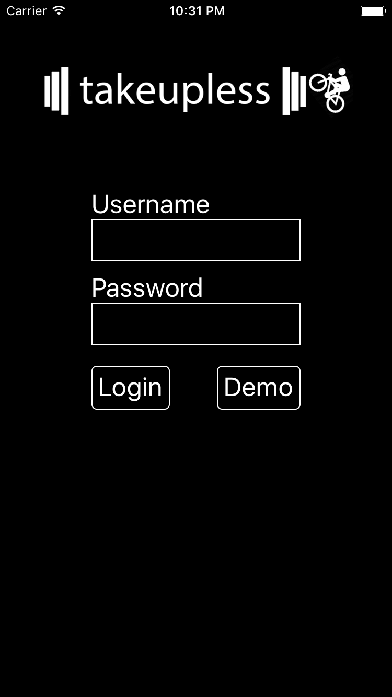
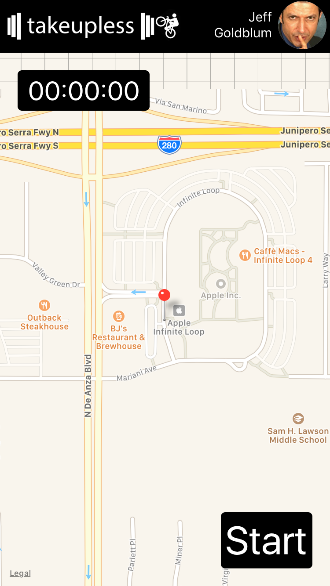
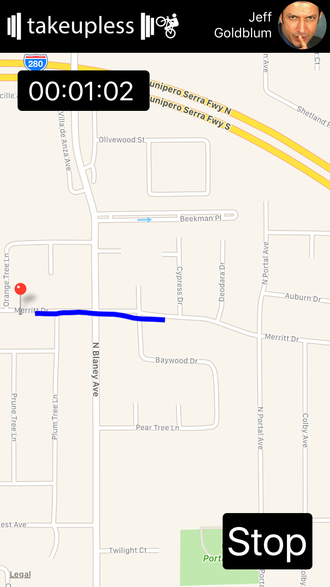
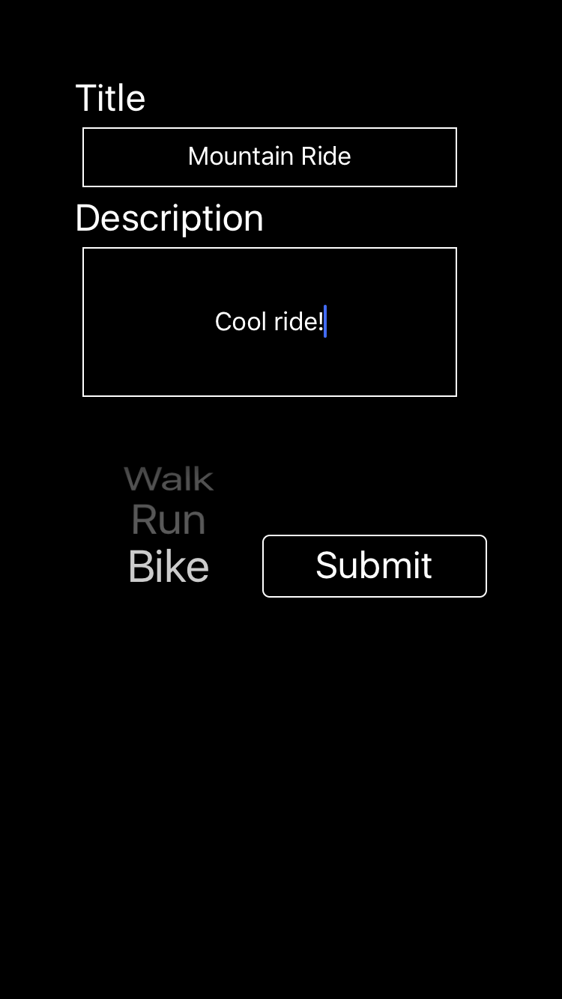
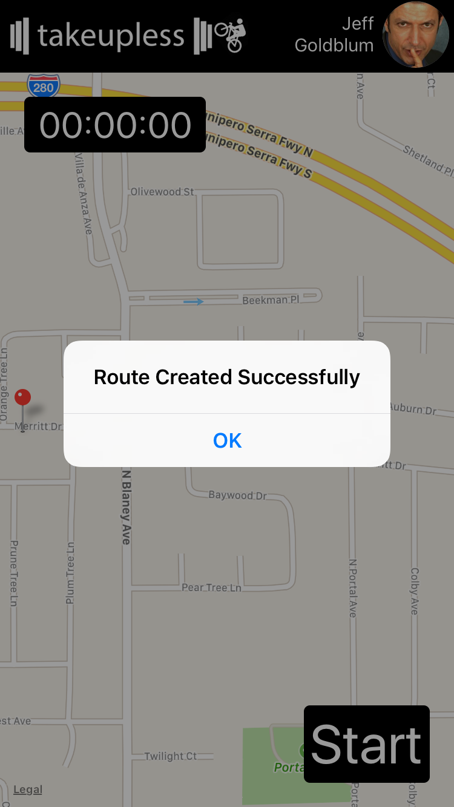
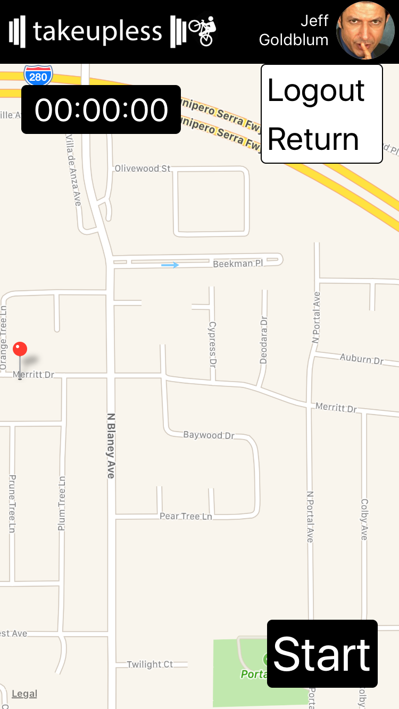
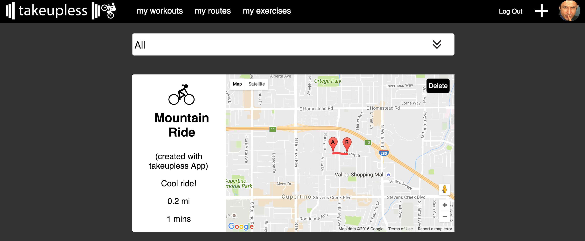

## takeupless App

takeupless App is an application for iOS and Android that serves as a route builder for my recent project [takeupless][tulurl].
[tulurl]: http://www.takeupless.space

[takeupless App live][iosurl] for iOS (please note that the full functionality of the App requires the user's location to change, which the emulator is unable to simulate).
[iosurl]: https://michaeljstevens.github.io/takeuplessApp/

[takeupless App][playurl] is also available for Android on the Google Play Store.

[playurl]: https://play.google.com/store/apps/details?id=com.takeuplessapp


### Background

This application is built for my recent project, [takeupless][tulurl], a workout tracking application that includes a route building feature. The purpose of this mobile application is to provide users an alternative method for creating routes. Before, users could only specify a start and end point in their browser and have the Google Maps API calculate a route between them. Now, it is possible to use the takeupless App to create a route based on a user's location in real time.


### Features

- Available for both iOS and Android
- Persistent login to takeupless account
- Real time location tracking
- Post new routes to takeupless account including distance and duration

### Architecture and Technologies

- JavaScript
- ReactJS
- React Native

### Installation Instructions

#### iOS (requires Mac)

- Clone repository
- Navigate to repository
- Install Xcode

To run in simulator:

- ````brew install node````
- ````brew install watchman````
- ````npm install -g react-native-cli````
- ````react-native run-ios````

To install on iPhone or iPad:

- Open iOS sub-directory in Xcode
- Connect device to computer
- Select device as build target
- Change build configuration to release (Product=>Scheme=>Edit Scheme)
- Select 'Build and Run the Current Scheme' (play button)

Note that depending on your Xcode configuration, there might be other steps required to build the project on your device. Consult the React Native documentation or feel free to contact me directly if you run into any problems.

#### Android

The easiest way to install the project on Android is downloading from the [Play Store][playurl].

To install on Android emulator:

- Download Android SDK and Platform Tools. I would recommend doing this through Android Studio.
- Install Android emulator and Google Play Services. You can use Android Studio or Genymotion. Without Google Play Services the map cannot be loaded.
- Start emulator
- ````brew install node````
- ````brew install watchman````
- ````npm install -g react-native-cli````
- ````react-native run-android````

To install on Android device (no play store)

- Enable USB debugging and connect device to computer
- Run ````adb devices```` to ensure device is recognized
- ````brew install node````
- ````brew install watchman````
- ````npm install -g react-native-cli````
- ````react-native start > /dev/null 2>&1 &````
- ````curl "http://localhost:8081/index.android.bundle?platform=android" -o "android/app/src/main/assets/index.android.bundle"````
- ````react-native run-android````

### Usage Instructions

To use, first create an account at [takeupless][tulurl] or use the provided demo account. You can then login.



Once you login, your session will persist until you logout manually or uninstall the application. You will arrive at a map screen with a stopwatch. Simply press Start and begin walking/running/cycling!



As you move, you'll see a line drawn on the map documenting where you've been.



When you finish, press Stop and a screen will appear for you to submit details about the route.



Press submit and the route will be submitted to your takeupless account.



To logout, touch your profile picture or username.



Login to your account the main [takeupless][tulurl] website to view your route.



### Code Snippets

To track a user's location, I used the data provided by the phone's GPS in coordination with [react-native-maps][mapsurl] to collect an array of latitudes and longitudes. I then calculate the distance between each set of coordinates and draw a line on the map between them.
[mapsurl]: https://github.com/airbnb/react-native-maps

First I set the geolocation to watchPosition, which signals the phone to report coordinate changes to the application. I then build a coordinates object and update the coordinates array in the state. I also set the center of the map to the new coordinates so that the user can see their current location.

```js
this.watch = navigator.geolocation.watchPosition(
  (position) => {
    const lat = position.coords.latitude;
    const lng = position.coords.longitude;
    const newCoords = Array.from(that.state.coordinates);
    const toAdd = {latitude: lat, longitude: lng};
    if(!newCoords.includes(toAdd)) {
      newCoords.push(toAdd);
    }
    that.setState({coordinates: newCoords, region: {
      latitude: lat,
      longitude: lng,
      latitudeDelta: 0.00922,
      longitudeDelta: 0.00421
    }, visible: false, started: true});
  },
  (error) => {console.log(error);},
  {enableHighAccuracy: true, distanceFilter: 1}
);
}
```
To get the total distance, I add the distance between each set of coordinates in the coordinates array.

```js
  getDistance() {
    let coordinates = this.state.coordinates;
    let kmDistance = 0;
    for (let i = 0; i < coordinates.length - 1; i++) {
      const lat1 = coordinates[i].latitude;
      const lon1 = coordinates[i].longitude;
      const lat2 = coordinates[i + 1].latitude;
      const lon2 = coordinates[i + 1].longitude;
      kmDistance += this.getDistanceFromLatLonInKm(lat1, lon1, lat2, lon2);
    }
    let mDistance = Math.round((kmDistance * 0.62) * 10)/10;
    let sDistance = `${mDistance} mi`;
    this.state.route.distance = sDistance;
  }

  calcCoords(lat1,lng1,lat2,lng2) {
    let earthRadius = 6371;
    let lat = this.rad(lat2-lat1);
    let lng = this.rad(lng2-lng1);
    let a =
      Math.sin(lat/2) * Math.sin(lat/2) +
      Math.cos(this.rad(lat1)) * Math.cos(this.rad(lat2)) *
      Math.sin(lng/2) * Math.sin(lng/2)
      ;
    let c = 2 * Math.atan2(Math.sqrt(a), Math.sqrt(1-a));
    let d = earthRadius * c;
    return d;
  }

  rad(deg) {
    return deg * (Math.PI/180);
  }
```
I created a stopwatch to show the elapsed time of the route live. I formatted the time using the following method.

```js
  formatTime() {
    let seconds = Math.round(this.state.elapsed / 1000);
    let minutes = Math.floor(seconds / 60);
    let hours = Math.floor(minutes / 60);
    seconds = seconds - (minutes * 60);
    minutes = minutes - (hours * 60);
    let formatted = `${hours < 10 ? 0 : ""}${hours}:${minutes < 10 ? 0 : ""}${minutes}:${seconds < 10 ? 0 : ""}${seconds}`;
    return formatted;
  }
```

### Future Direction

I plan to increase the functionality of the app to be more in line with its parent site. I plan to add:

- Workout creation
- View stats
- Create and edit profiles
- Create exercises
