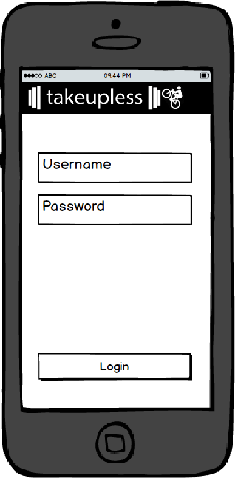
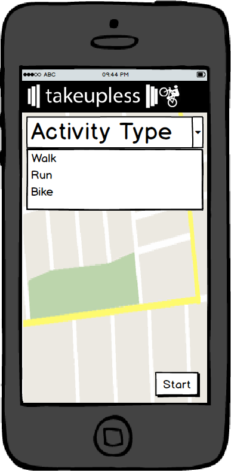

## takeupless App

### Background

My recent project, [takeupless](http://www.takeupless.space), provides a feature for users to input walk/run/bike workout data via a Google Maps route. This is not ideal. For one, routes are limited to the directions that Google provides between two points. Secondly, users must input their routes before or after the fact. This project aims to remedy these problems by introducing an app that will track the distance and route of a user's walk/run/bike workout using an iPhone or Android GPS in real time.

### Functionality & MVP

This app will provide the following functionality:

- [ ] User login,
- [ ] Choice between walk, run, and bike,
- [ ] Record distance, duration, of route, save route to database,
- [ ] Option for both iOS and Android operating systems.

### Wireframes

### Technologies & Technical Challenges

This app will be implemented in React Native and Redux. `index.android.js` and `index.ios.js` will serve as the entry point for the Android and iOS implementations, respectively. I will use the `react-native-maps` library to render the map to the screen. This will require slightly different installation processes for iOS in XCode and Android in Android Studio.

I will have header and footer components, a user login component, and a maps component.

- `header.js`: will render the header component with a logo image.
- `footer.js`: will render the footer component with my name and link to github.
- `login.js`: will render the user login page.
- `map.js`: will render the map and handle the login for recording a route.

I will also have two redux cycles: one for creating a new user session and one for creating a new route.

The primary technical challenges will be:

- Becoming competent in React Native. Although similar to React, there are some key differences that will be challenging.

- Ensuring my Rails backend for my full-stack project is viable for making post requests from an app.

- Working with Google Maps to use the GPS to record a route in real time.

- Persisting user login. I think I will have to write local files to the device in order to keep a user from having to re login every time. As it stands, I'm ensure how to do this and will have to learn.

### Implementation Timeline

**Day 1**: Get a map rendered on both iOS and Android emulators. I plan to use the `react-native-maps` library which makes the process fairly simple, but requires a different installation process for each operating system. I also plan to make any necessary changes to my Rails backend on this day in order for it to be used as an API for the app.

**Day 2**: Make it so a user can login to the app. I will need to create a login form and redux cycle for this to work. For now, this app will only permit login and logout, saving sign up as a bonus feature. The current user have to be written to the phone's memory to ensure login persists between sessions.

- The ability to login and logout
- Logged in user should persist.

**Day 3-4**: Implement logic to store routes in real time.

- Implement an algorithm for saving the GPS location at short time increments during the recording of a route.
- Should also calculate the distance between each point to get a total distance.
- Should record the duration of a route from start to end.

**Day 5**: Create the map component with a dropdown menu to select activity type and start/stop button.

- Create a dropdown menu.
- Create a start button that triggers real time activity recording algorithm. Start button should become stop button when pressed.

**Day 6**: Create redux cycle for map. It will make a post requests to the api at the route table.

**Day 7**: Style components, bug fixes, etc.

- Do bonuses if time permits.

### Bonus

- Allow users to add workout via the app for all activity types (walk/run/bike/lift).
- User sign up via app.
- Home page with stats.
